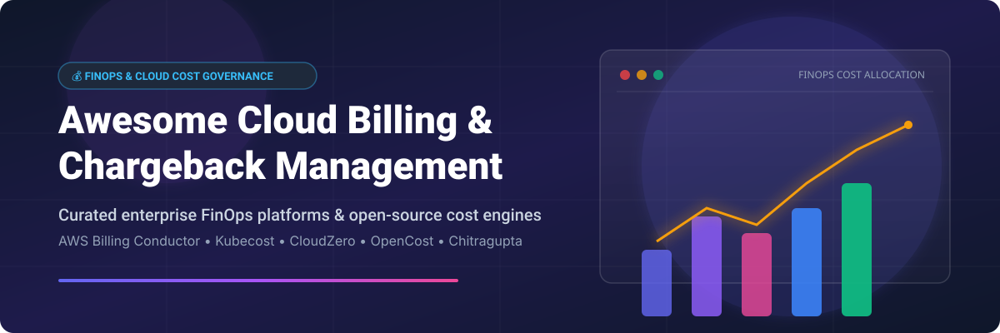

# Awesome-Cloud-Billing-Chargeback-Management 💰 📊

  

  
  
  
  
  
  

---

## 🌟 Top Cloud Billing & Chargeback Management Ecosystem 🚀

**Curated List of Commercial FinOps Platforms & Open-Source Chargeback Engines**  

*Focused on Showback/Chargeback, Cost Allocation, Commitment Management, Unit Economics & Self-Hosted Billing Automation* 📈

**Last updated: October 2026** 📅

---

### 📌 Overview & SEO Summary 🔍

Welcome to the ultimate curated directory of **cloud billing and chargeback management platforms**, **open-source cost allocation engines**, and **FinOps automation frameworks**. Whether you are looking for enterprise-grade commercial solutions (such as *AWS Billing Conductor*, *CloudZero*, and *Apptio Cloudability*), or self-hostable open-source alternatives (like *Infracost*, *Cloud Custodian*, *Kubecost*, and *OpenCost*), this list covers category leaders, pro forma billing, and privacy-respecting cost governance.

---

## 📑 Table of Contents 📋

- [🏢 SaaS & Commercial Platforms](#-saas--commercial-platforms)
- [🔓 Open-Source GitHub Projects](#-open-source-github-projects)
- [🛠️ How to Contribute](#%EF%B8%8F-how-to-contribute)
- [📊 Star History](#-star-history)
- [🤝 Support & Sponsorship](#-support--sponsorship)
- [⚠️ Disclaimer](#%EF%B8%8F-disclaimer)

---

## 🏢 SaaS / Commercial Platforms 🏬

> 💡 **Market Overview**: The global Cloud Financial Management (FinOps) and Cloud Billing/Chargeback market is estimated at **~$12.5 Billion** and is projected to reach over **$28.4 Billion by 2030** (CAGR ~17.8%). The sector is currently **moderately fragmented**, featuring native cloud hyper-scaler solutions (AWS Billing Conductor), enterprise software suites (IBM/Apptio), and high-growth VC-backed FinOps platforms (CloudZero, Vantage, Finout).

The cloud billing and chargeback market spans **native cloud provider tools** (AWS Billing Conductor) that generate pro forma bills for customized showback/chargeback, and **specialized FinOps platforms** that charge as a percentage of managed spend or per-resource fees.

*Sorted by Company Revenue / Market Cap / Valuation (Descending)* 📊

| SaaS / Commercial Platform | Company / Owner | Valuation / Revenue / Market Cap 🏢 | Standard Edition Starting Price 💵 | Free Tier / Free Trial Limits 🎁 | Description 📝 |
| :--- | :--- | :--- | :--- | :--- | :--- |
| **[AWS Billing Conductor](https://aws.amazon.com/aws-cost-management/aws-billing-conductor/)** ☁️ | Amazon | ~$2.0 Trillion Market Cap | Free for billing transfer users; $0.15 per pro forma bill line item for standard billing groups | Free for billing transfer accounts; 62-day free tier trial for standard billing groups | **AWS-native pro forma billing** — Creates a **second version of costs** for showback/chargeback. Custom pricing with global or specific markups/discounts. **Pro forma data differs from actual AWS bill**. |
| **[Apptio Cloudability](https://www.apptio.com/products/cloudability/)** 💰 | IBM (Apptio) | ~$200 Billion Market Cap (IBM) | $2,500/month for up to $1M managed spend on AWS Marketplace | 14-day free trial; free tier available for up to 3 cloud accounts | **Percentage-of-spend FinOps platform** — Allocates 100% of cloud costs including containers, support, and shared services with ML-based forecasting and budget tracking. |
| **[Spot Eco](https://spot.io/products/eco/)** 🟢 | NetApp | ~$20 Billion Market Cap | $1.415 per 100 vCPU hours for managed compute; fee percentage on savings | 30-day free trial; free tier for up to 20 VMs managed | **Commitment management automation** — All-in-one solution combining automation, ML, and human oversight to optimize RI/SP portfolios across AWS, Azure, GCP. |
| **[Harness CCM](https://www.harness.io/)** 🚀 | Harness | ~$3.7 Billion Valuation | Enterprise SKUs starting at $250/month per module | Free Forever tier for <$250K/year cloud spend (limit 2 K8s clusters, 30-day data retention) | **Modular FinOps platform** — Buy SKUs individually or bundle. Commitment Orchestrator for Savings Plans optimization, AutoStopping for idle resources, and Karpenter autoscaling. |
| **[Anodot](https://www.anodot.com/)** 📈 | Anodot | ~$250 Million Valuation | Enterprise starting tier at $500/month | 14-day free trial with full feature access | **Cloud cost management for MSPs** — Cloud unit economics measurement for profit margin optimization and commitment portfolio management with automated RI/SP purchasing recommendations. |
| **[CloudZero](https://www.cloudzero.com/)** 📊 | CloudZero | ~$150 Million Valuation | Platform subscription starting at $1,500/month based on managed spend | 14-day free trial with sample cloud spend ingestion | **Unit economics cloud cost platform** — Answers "What does it cost to serve this customer?" Allocation by customer, team, product, or feature for engineering-led cost accountability. |
| **[Vantage](https://www.vantage.sh/)** 💰 | Vantage | ~$100 Million Valuation | Pro tier starting at $30/month + 3% of managed spend | Free tier available forever (2 cloud accounts, 10 cost reports, 5 dashboards) | **Cloud cost transparency platform** — Multi-cloud cost visibility with savings opportunities via Compute Optimizer, Rightsizing, and Reserved Instance recommendations. |
| **[Finout](https://www.finout.io/)** 🎯 | Finout | ~$80 Million Valuation | Starter plan at $500/month for up to $100K monthly spend | 14-day free trial with full MegaBill access | **MegaBill cost management** — Amortized cost calculations for commitment-based billing. Kubernetes cost allocation with configurable CPU/memory ratios. |
| **[Yotascale](https://www.yotascale.com/)** 🔍 | Yotascale | ~$40 Million Valuation | Custom enterprise tier starting at $1,000/month | 14-day free trial upon sandbox request | **Multi-cloud cost management** — Container cost allocation, Kubernetes cost optimization, and commitment management focusing on engineering accountability. |

---

## 🔓 Open-Source GitHub Projects 💻

*Sorted by GitHub Stars Count (Descending)* 🌟

- **[Infracost](https://github.com/infracost/infracost)**   
  **Cloud cost estimates for Terraform in pull requests**, Apache-2.0 licensed. **Shift-left FinOps** — shows cost impact of infrastructure changes before deployment. Supports AWS, Azure, GCP, and 1,000+ resources. CLI, GitHub Actions, GitLab CI, and VS Code extension. 💰 🛠️

- **[Cloud Custodian](https://github.com/cloud-custodian/cloud-custodian)**   
  **Rules engine for cloud security, cost optimization, and governance**, Apache-2.0 licensed. YAML-based policies for AWS, Azure, GCP. Automated remediation: tag enforcement (critical for chargeback allocation), idle resource cleanup, rightsizing, and compliance. 🛡️ ⚡

- **[Komiser](https://github.com/tailwarden/komiser)**   
  **Cloud resource visibility and cost optimization**, Apache-2.0 licensed. Multi-cloud dashboard for AWS, Azure, GCP, DigitalOcean, and Kubernetes. Detects idle resources, orphaned volumes, and untagged assets. 🔍 🌐

- **[Kubecost (Open Source Core)](https://github.com/kubecost/cost-analyzer-helm-chart)**   
  **Kubernetes cost monitoring and optimization**, Apache-2.0 licensed. Real-time cost allocation by cluster, node, namespace, controller, service, or pod. Integrates with AWS, Azure, and GCP billing APIs for accurate pricing. 📊 ☸️

- **[OpenCost](https://github.com/opencost/opencost)**   
  **Open-source cost monitoring for Kubernetes and cloud spend**, Apache-2.0 licensed (CNCF Sandbox project). Real-time cost allocation by cluster, node, namespace, controller, service, or pod across multi-cloud environments. 🌱 ☁️

- **[Karpenter](https://github.com/aws/karpenter-provider-aws)**   
  **Just-in-time Kubernetes node autoscaling and cost optimization**, Apache-2.0 licensed. Automatically launches right-sized compute nodes based on pod workload requirements to reduce compute waste and lower cloud bills. 🚀 ⚙️

- **[Chitragupta](https://github.com/waliaabhishek/chitragupta)**   
  **Open-source chargeback engine framework**, open-source. Named after the Hindu deity who maintains a complete record of actions — the divine accountant. Brings together billing, resource inventory, and usage data across Confluent Cloud, Kafka, and Prometheus. 🏛️ 📜

- **[Kubernetes Metering Operator](https://github.com/kube-reporting/metering-operator)**   
  **Kubernetes chargeback and usage reporting**, Apache-2.0 licensed. Collects metrics and information about what is happening in a Kubernetes cluster and provides reports for namespace or pod level chargeback. 📉 📋

- **[Cloudforet](https://github.com/cloudforet-io/console)**   
  **Open-source multi-cloud management platform**, Apache-2.0 licensed. Provides integrated cost analysis, billing visualization, asset inventory management, and multi-cloud governance for AWS, Azure, and GCP. 🪐 📊

- **[ccloud-chargeback-helper](https://github.com/waliaabhishek/ccloud-chargeback-helper)**   
  **Confluent Cloud Billing Chargeback Helper**, open-source. Python-based tool for allocating Confluent Cloud costs to internal teams and service accounts. 🐍 💵

---

## 🛠️ How to Contribute 🤝

Contributions are welcome! Follow these steps to submit new cloud billing platforms or open-source chargeback software:

1. 🍴 **Fork** the repository.
2. 📝 **Add/edit** entries in `README.md` maintaining table/list structure and formatting.
3. 🔗 Include project title, official website/GitHub link, exact Stars Count, license, and brief description.
4. 🚀 Submit a **Pull Request** with a descriptive summary of your changes.

---

## 📊 Star History ⭐

---

## 🤝 Support & Sponsorship 💖

Thank you for visiting and supporting the **Awesome Cloud Billing & Chargeback Management** ecosystem! If you find this curated directory useful for your FinOps workflows, cloud cost governance, or infrastructure budgeting, please consider supporting the project:

- ⭐ **Star** this repository to help others discover it!
- 🔀 **Fork** and share with fellow FinOps engineers, DevOps specialists, and finance teams.
- ☕ **Sponsor & Buy Me a Coffee**: Support ongoing open-source curation and research via the [GitHub Sponsor Dashboard](https://github.com/sponsors/ishandutta2007).

---

## ⚠️ Disclaimer ℹ️

- This is a **community-curated** list — not exhaustive and not an endorsement. ℹ️
- **AWS Billing Conductor pro forma data is not your actual AWS bill** — it's a customized view for showback/chargeback that differs from real charges due to AWS. Billing transfer groups are free; standard billing groups are charged.
- **Harness CCM Free Forever** limits cloud spend to **$250K/year** with **2 Kubernetes clusters** and **30-day data visibility**. Organizations exceeding these limits must upgrade to Enterprise SKUs.
- Open-source solutions (Chitragupta, Kubecost, OpenCost, Infracost) provide self-hosted ownership and transparency, but enterprise-grade SLA guarantees, multi-cloud cost allocation at scale, and vendor support remain primarily commercial offerings. **Always validate chargeback data against native cloud billing consoles** before issuing internal invoices. 💰

---

  <b>Made with ❤️ for FinOps engineers, finance teams, and open-source cost governance advocates.</b>

